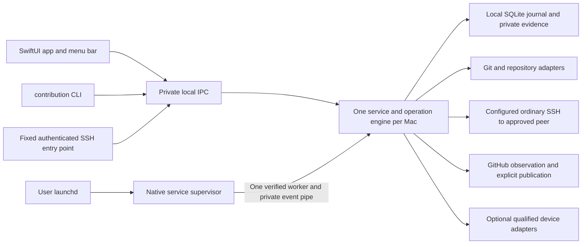

# Architecture

Contribution uses one shared engine worker per Mac. The native app, CLI and authenticated remote entry point are clients of its private IPC. A verified native parent supervises one immutable worker and relays bounded categorical hints; it makes no workflow decisions. Source and disposable fixtures implement these boundaries, while installed launchd, signing and real-host qualification remain separate. See [current implementation](IMPLEMENTATION_STATUS.md); [S0 setup](SETUP_STATUS.md) is historical.

## Historical foundation decisions for S0

| Area | Selected direction | Setup treatment |
|---|---|---|
| Native application | SwiftUI, Swift 6 language mode, Apple Silicon first | Build a minimal app and menu-bar shell; select and record an exact installed compatible Xcode/Swift toolchain |
| Minimum OS | macOS 14.0 is the initial product support target | Verify all selected dependencies and APIs against it; raising it requires an explicit recorded compatibility decision, not a guessed host inventory |
| Native build | Checked-in Xcode project and shared schemes; local Swift packages where useful | Keep a real app-bundle build path for later helper embedding, signing, entitlements, and updater integration |
| Shared runtime | Bundled Node.js 24 LTS and TypeScript | Pin an exact supported patch, compiler, and package manager during setup; never ship a mutable `latest` dependency |
| Workspace | pnpm workspace for engine, CLI, contracts, and adapters | Pin pnpm and commit one lockfile; no monorepo orchestration service is needed |
| Contracts | JSON Schema draft 2020-12 | Preserve all initial schemas; use one source for runtime validation and generated/checked client representations |
| Tests | Node's test runner for compiled TypeScript; native XCTest/Swift Testing as appropriate | Start with contract and boundary smoke checks; later use real disposable Git repositories and public interfaces |
| State | Service-owned SQLite WAL database on local disk | Specify the boundary now; choose and qualify the exact Node/SQLite binding in M1 before durability claims |
| Packaging | One app release carries native code, engine, CLI, and pinned runtime | Setup creates reproducible local build artifacts; signed/notarized distribution and Sparkle integration remain M6 work |
| Distribution and permissions | Direct macOS distribution, standard user permissions, App Sandbox disabled | Arbitrary enrolled checkouts and repository subprocesses require a deliberate permissions model; retain hardened-runtime qualification for release, no root daemon or automatic Full Disk Access request |

The macOS deployment target is a support choice, not evidence that either user's Mac runs that version. An iPhone operation has its own Xcode/iOS/backend compatibility matrix. App deployment compatibility does not imply that an old Xcode can build the app or operate a newer phone. Exact tool versions and observed host facts belong in the setup record.

Node 24 is the selected LTS line based on the [official release schedule](https://nodejs.org/en/about/previous-releases), checked during this review. Recheck support and security status when pinning the setup patch. The chosen engine runtime never overrides enrolled projects' runtime pins.

## Boundaries that must survive implementation

- **One writer:** the installed service owns admission, scheduling, SQLite, events, subprocess supervision, and retries. The Swift helper registers it through supported macOS mechanisms; it does not introduce another scheduler.
- **Frozen requests:** bind source, destination, policy, caller authority, and request identity before durable acceptance. Reusing an ID with changed meaning is a conflict.
- **Non-atomic effects:** Git, remote delivery, device actions, files, and SQLite cannot commit atomically. Retain intent, observed effects, and uncertainty; reconcile before repeating mutations.
- **Git authority:** a paired Mini serializes canonical landing and publication. The laptop has a retained outbox and safe primary mirror. Offline status never elects a new owner.
- **Project adapters:** preserve hook ownership, leases, attribution, validation, source selection, signing, and product data policy. Shared mechanics do not make policies uniform.
- **Native clients:** communicate over private local IPC with bounded frames, caller checks, version negotiation, reconnect cursors, and finite waits. No arbitrary shell or public unauthenticated control API.
- **Installed payloads:** attempts use an immutable release payload, independent of the source checkout. Updates drain active work and preserve queued requests without widening their scope.
- **Secrets and evidence:** pairing and signing assets remain independently provisioned in private stores. Public docs and fixtures contain synthetic identities. Raw evidence stays local and controlled.

The later phone-only travel route uses supported remote agent access if available. If absent, RDEV-26 requires a small authenticated private browser endpoint within the same service. This conditional surface is in scope; S0 only records the decision and boundary.

## Device backend decision

Preserve native Xcode/CoreDevice as the local baseline. Investigate an exact pinned go-ios revision first for remote operations. Its presence in the dependency graph is not support evidence. The upstream [go-ios README](https://github.com/danielpaulus/go-ios) includes privileged tunnel setup as well as userspace-related options; D0/D1 must establish the actual route and privileges of the pinned revision. Do not copy a `sudo` quick-start into Contribution's normal service lifecycle.

Device-operation ownership is independent of canonical Git ownership. Host switching requires release or reconciliation, and lease expiry cannot prove a former host stopped. Each operation needs evidence for the exact host/toolchain/device/backend/network context. OTA, if qualified, is installation only unless separate evidence proves more.

Full process and recovery detail lives in [02 Architecture](requirements/02-ARCHITECTURE.md); exact interface spelling lives in [03 Agent contract](requirements/03-AGENT_CONTRACT.md).
